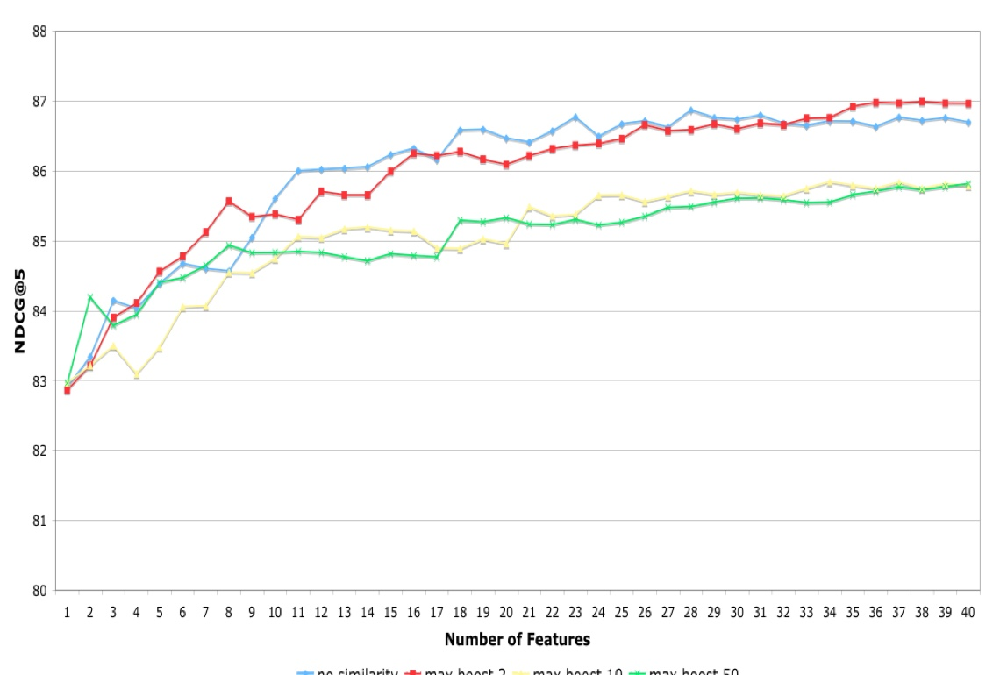
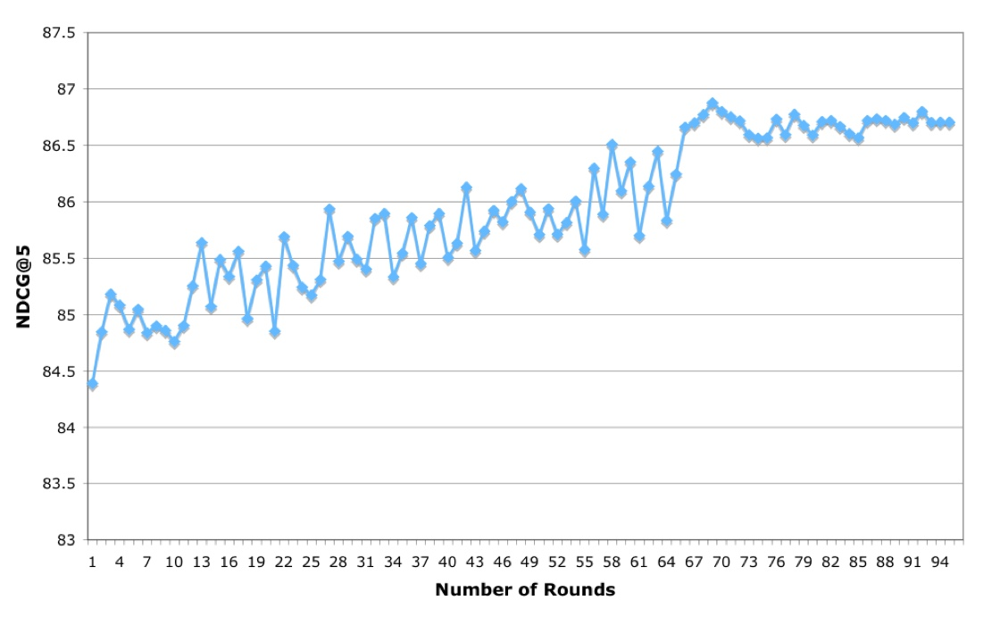

> 该篇文章作者针对搜索引擎在候选集排序中，特征数量过多导致需要过长的排序时间和用户体验之间的矛盾，介绍了基于boosted trees对排序算法的特征进行选择，作者提出了两种基于booster trees的特征选择方法：
> 1.  在树算法结果产生的特征重要度的基础上考虑进特征相似度
> 2.  一种基于特征重要度的逆向特征消除算法

目前基于boosted trees的搜索排序方法很多，如McRank [9], LambdaMART [4], RankBoost [12], and AdaRank [10].但做排序特征选择很少，并且目前的很多搜索排序特征选择算法很难将查询关键词的上下文特征引入进去。使用booser trees做特征选择，一种最直接的方式是选择top n的特征，但有些学者发现，特征重要度是根据上下文计算的，即组合特征，当我们只取少部分特征时，可能在所有特征中比较重要的特征就变得不重要了。

### 特征相似度方法

特征相似度方法主要是针对 booster trees获得的特征重要度分值，首先计算特征的相关度矩阵，选择特征重要度分值最大的特征当做起始特征，然后计算其余特征值的重要度，重要度定义为在特征重要度分值与特征相似度加权（max boost），其中权重取值2~50，结果显示max boost为2的时候结果最好，但和直接使用top30的重要度特征效率差不都。

### 随机选择方法

随机选择方法通过先将所有特征分成不相交的等量特征子集，比如30，然后循环迭代：

1\. 使用每个子集的30个特征训练boosted trees

2.定义feature elimination rate表示每次迭代要删除的总特征个数

2.各个子集删除的特征的个数由他们的目标函数分值决定，但需要保证每个子集每次都删除一个特征，每个子特征集删除的特征数量通过目标函数减少的比率

3\. 循环迭代1~2，直到剩下我们需要的特征个数。

